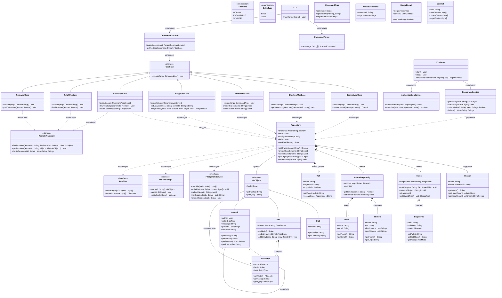

```mermaid
classDiagram    
    class GitObject {
        <<abstract>>
        +hash: String
        +getHash() String
        +getType() String
    }
    
    class Blob {
        +content: byte[]
        +getHash() String
        +getContent() byte[]
    }
    
    class Tree {
        +entries: Map~String, TreeEntry~
        +getHash() String
        +getEntry(path: String) TreeEntry
        +addEntry(path: String, entry: TreeEntry) void
    }
    
    class TreeEntry {
        +mode: FileMode
        +hash: String
        +type: EntryType
        +getMode() FileMode
        +getHash() String
        +getType() EntryType
    }
    
    class Commit {
        +author: User
        +date: DateTime
        +message: String
        +parents: List~String~
        +treeHash: String
        +getHash() String
        +getAuthor() User
        +getParents() List~String~
        +getTreeHash() String
    }
    
    class Branch {
        +name: String
        +headCommitHash: String
        +getName() String
        +getHeadCommitHash() String
        +setHeadCommitHash(hash: String) void
    }
    
    class Repository {
        +branches: Map~String, Branch~
        +HEAD: Ref
        +config: RepositoryConfig
        +index: Index
        +workingDirectory: String
        +getBranch(name: String) Branch
        +createBranch(name: String) void
        +deleteBranch(name: String) void
        +getObject(hash: String) GitObject
        +storeObject(obj: GitObject) void
    }
    
    class Index {
        +stagedFiles: Map~String, StagedFile~
        +addFile(path: String, file: StagedFile) void
        +removeFile(path: String) void
        +clear() void
        +getStagedFiles() List~StagedFile~
    }
    
    class StagedFile {
        +path: String
        +blobHash: String
        +mode: FileMode
        +getPath() String
        +getBlobHash() String
        +getMode() FileMode
    }
    
    class Ref {
        +name: String
        +targetHash: String
        +isSymbolic: boolean
        +getTargetHash() String
        +resolve(repo: Repository) String
    }
    
    class Remote {
        +name: String
        +url: String
        +fetchSpecs: List~String~
        +pushSpecs: List~String~
        +getName() String
        +getUrl() String
    }
    
    class RepositoryConfig {
        +remotes: Map~String, Remote~
        +user: User
        +getRemote(name: String) Remote
        +addRemote(remote: Remote) void
    }
    
    class User {
        +name: String
        +email: String
        +getName() String
        +getEmail() String
    }
    
    class FileMode {
        <<enumeration>>
        NORMAL
        EXECUTABLE
        SYMLINK
    }
    
    class EntryType {
        <<enumeration>>
        BLOB
        TREE
    }
        
    class UseCase {
        <<interface>>
        +execute(args: CommandArgs) void
    }
    
    class CommitUseCase {
        +execute(args: CommandArgs) void
        -createCommit(message: String) Commit
    }
    
    class CheckoutUseCase {
        +execute(args: CommandArgs) void
        -updateWorkingDirectory(commitHash: String) void
    }
    
    class BranchUseCase {
        +execute(args: CommandArgs) void
        -createBranch(name: String) void
        -deleteBranch(name: String) void
    }
    
    class MergeUseCase {
        +execute(args: CommandArgs) void
        -findLCA(commit1: String, commit2: String) String
        -mergeTrees(base: Tree, current: Tree, target: Tree) MergeResult
    }
    
    class CloneUseCase {
        +execute(args: CommandArgs) void
        -downloadObjects(remote: Remote) void
        -createLocalRepository() Repository
    }
    
    class FetchUseCase {
        +execute(args: CommandArgs) void
        -fetchRemote(remote: Remote) void
    }
    
    class PushUseCase {
        +execute(args: CommandArgs) void
        -pushToRemote(remote: Remote) void
    }
        
    class FileSystemService {
        <<interface>>
        +readFile(path: String) byte[]
        +writeFile(path: String, content: byte[]) void
        +deleteFile(path: String) void
        +listDirectory(path: String) List~String~
        +createDirectory(path: String) void
    }
    
    class ObjectStorage {
        <<interface>>
        +get(hash: String) GitObject
        +put(obj: GitObject) void
        +exists(hash: String) boolean
    }
    
    class Serializer {
        <<interface>>
        +serialize(obj: GitObject) byte[]
        +deserialize(data: byte[]) GitObject
    }
    
    class RemoteTransport {
        <<interface>>
        +fetchObjects(remoteUrl: String, hashes: List~String~) List~GitObject~
        +pushObjects(remoteUrl: String, objects: List~GitObject~) void
        +listRefs(remoteUrl: String) Map~String, String~
    }
        
    class CommandParser {
        +parse(args: String[]) ParsedCommand
    }
    
    class CommandExecutor {
        +execute(command: ParsedCommand) void
        -getUseCase(command: String) UseCase
    }
    
    class CLI {
        +main(args: String[]) void
    }
        
    class VcsServer {
        +start() void
        +stop() void
        -handleRequest(request: HttpRequest) HttpResponse
    }
    
    class RepositoryService {
        +getObject(hash: String) GitObject
        +putObject(obj: GitObject) void
        +updateRef(ref: String, hash: String) boolean
        +listRefs() Map~String, String~
    }
    
    class AuthenticationService {
        +authenticate(request: HttpRequest) User
        +authorize(user: User, operation: String) boolean
    }
        
    class CommandArgs {
        +command: String
        +options: Map~String, String~
        +arguments: List~String~
    }
    
    class ParsedCommand {
        +command: String
        +args: CommandArgs
    }
    
    class MergeResult {
        +mergedTree: Tree
        +conflicts: List~Conflict~
        +hasConflicts() boolean
    }
    
    class Conflict {
        +path: String
        +baseContent: byte[]
        +currentContent: byte[]
        +targetContent: byte[]
    }
    
    GitObject <|-- Blob
    GitObject <|-- Tree
    GitObject <|-- Commit
    
    UseCase <|-- CommitUseCase
    UseCase <|-- CheckoutUseCase
    UseCase <|-- BranchUseCase
    UseCase <|-- MergeUseCase
    UseCase <|-- CloneUseCase
    UseCase <|-- FetchUseCase
    UseCase <|-- PushUseCase
    
    Repository "1" *-- "*" Branch : содержит
    Repository "1" *-- "1" Index : имеет
    Repository "1" *-- "1" RepositoryConfig : имеет
    Repository "1" *-- "1" Ref : имеет (HEAD)
    
    Index "1" *-- "*" StagedFile : содержит
    Tree "1" *-- "*" TreeEntry : содержит
    RepositoryConfig "1" *-- "*" Remote : содержит
    RepositoryConfig "1" *-- "1" User : имеет
    
    Commit "1" -- "*" Commit : родители
    Repository "1" -- "*" GitObject : хранит
    TreeEntry "1" -- "1" GitObject : ссылается на
    
    CommitUseCase ..> Repository : использует
    CheckoutUseCase ..> Repository : использует
    BranchUseCase ..> Repository : использует
    MergeUseCase ..> Repository : использует
    CloneUseCase ..> Repository : создает
    CloneUseCase ..> RemoteTransport : использует
    FetchUseCase ..> RemoteTransport : использует
    PushUseCase ..> RemoteTransport : использует
    
    Repository ..> FileSystemService : использует
    Repository ..> ObjectStorage : использует
    Repository ..> Serializer : использует
    
    CLI --> CommandParser : использует
    CLI --> CommandExecutor : использует
    CommandExecutor ..> UseCase : исполняет
    
    VcsServer --> RepositoryService : использует
    VcsServer --> AuthenticationService : использует
    RepositoryService ..> Repository : управляет
```