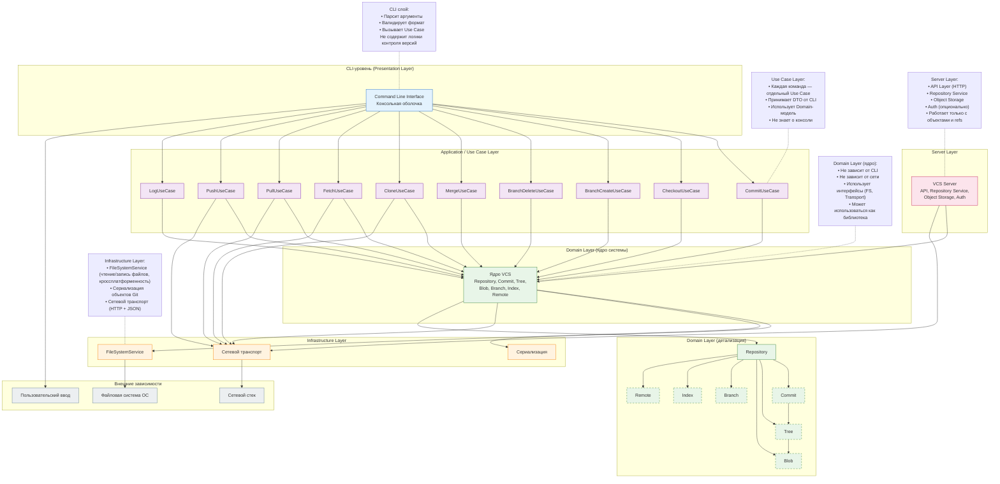

```mermaid
graph TB    
    subgraph "CLI-уровень (Presentation Layer)"
        CLI[Command Line Interface<br/>Консольная оболочка]
    end
    
    subgraph "Application / Use Case Layer"
        CommitUC[CommitUseCase]
        CheckoutUC[CheckoutUseCase]
        BranchCreateUC[BranchCreateUseCase]
        BranchDeleteUC[BranchDeleteUseCase]
        MergeUC[MergeUseCase]
        CloneUC[CloneUseCase]
        FetchUC[FetchUseCase]
        PullUC[PullUseCase]
        PushUC[PushUseCase]
        LogUC[LogUseCase]
    end
    
    subgraph "Domain Layer (ядро системы)"
        Core[Ядро VCS<br/>Repository, Commit, Tree,<br/>Blob, Branch, Index, Remote]
    end
    
    subgraph "Infrastructure Layer"
        FS[FileSystemService]
        Serializer[Сериализация]
        Network[Сетевой транспорт]
    end
    
    subgraph "Server Layer"
        Server[VCS Server<br/>API, Repository Service,<br/>Object Storage, Auth]
    end
    
    subgraph "Внешние зависимости"
        ФС[Файловая система ОС]
        Сеть[Сетевой стек]
        Пользователь[Пользовательский ввод]
    end
        
    CLI --> CommitUC
    CLI --> CheckoutUC
    CLI --> BranchCreateUC
    CLI --> BranchDeleteUC
    CLI --> MergeUC
    CLI --> CloneUC
    CLI --> FetchUC
    CLI --> PullUC
    CLI --> PushUC
    CLI --> LogUC
    
    CommitUC --> Core
    CheckoutUC --> Core
    BranchCreateUC --> Core
    BranchDeleteUC --> Core
    MergeUC --> Core
    CloneUC --> Core
    FetchUC --> Core
    PullUC --> Core
    PushUC --> Core
    LogUC --> Core
    
    Core --> FS
    Core --> Serializer
    Core --> Network
    
    CloneUC --> Network
    FetchUC --> Network
    PullUC --> Network
    PushUC --> Network
    
    Server --> Core
    Server --> Network
    
    FS --> ФС
    Network --> Сеть
    CLI --> Пользователь
    
    subgraph "Domain Layer (детализация)"
        Repository[Repository]
        Commit[Commit]
        Tree[Tree]
        Blob[Blob]
        Branch[Branch]
        Index[Index]
        Remote[Remote]
        
        Repository --> Commit
        Repository --> Tree
        Repository --> Blob
        Repository --> Branch
        Repository --> Index
        Repository --> Remote
        Commit --> Tree
        Tree --> Blob
    end
    
    Core --> Repository
        
    note1["CLI слой:
    • Парсит аргументы
    • Валидирует формат
    • Вызывает Use Case
    Не содержит логики контроля версий"]
    
    note2["Use Case Layer:
    • Каждая команда — отдельный Use Case
    • Принимает DTO от CLI
    • Использует Domain-модель
    • Не знает о консоли"]
    
    note3["Domain Layer (ядро):
    • Не зависит от CLI
    • Не зависит от сети
    • Использует интерфейсы (FS, Transport)
    • Может использоваться как библиотека"]
    
    note4["Infrastructure Layer:
    • FileSystemService (чтение/запись файлов, кроссплатформенность)
    • Сериализация объектов Git
    • Сетевой транспорт (HTTP + JSON)"]
    
    note5["Server Layer:
    • API Layer (HTTP)
    • Repository Service
    • Object Storage
    • Auth (опционально)
    • Работает только с объектами и refs"]
    
    note1 -.- CLI
    note2 -.- CommitUC
    note3 -.- Core
    note4 -.- FS
    note5 -.- Server
    
    classDef cli fill:#E3F2FD,stroke:#1565C0
    classDef usecase fill:#F3E5F5,stroke:#7B1FA2
    classDef domain fill:#E8F5E8,stroke:#2E7D32
    classDef infra fill:#FFF3E0,stroke:#F57C00
    classDef server fill:#FCE4EC,stroke:#C2185B
    classDef external fill:#ECEFF1,stroke:#607D8B
    classDef detail fill:#E8F5E8,stroke:#2E7D32,stroke-dasharray: 5 5
    
    class CLI cli
    class CommitUC,CheckoutUC,BranchCreateUC,BranchDeleteUC,MergeUC,CloneUC,FetchUC,PullUC,PushUC,LogUC usecase
    class Core,Repository,Commit,Tree,Blob,Branch,Index,Remote domain
    class FS,Serializer,Network infra
    class Server server
    class ФС,Сеть,Пользователь external
    class Commit,Tree,Blob,Branch,Index,Remote detail
```