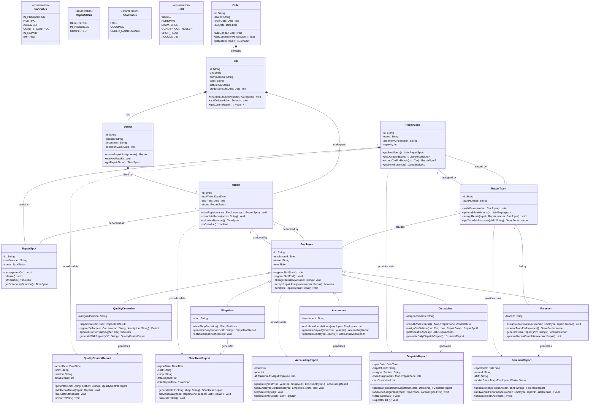

```mermaid
classDiagram
    direction TB
    
    class CarStatus {
        <<enumeration>>
        IN_PRODUCTION
        PAINTING
        ASSEMBLY
        QUALITY_CONTROL
        IN_REPAIR
        SHIPPED
    }
    
    class RepairStatus {
        <<enumeration>>
        REGISTERED
        IN_PROGRESS
        COMPLETED
    }
    
    class SpotStatus {
        <<enumeration>>
        FREE
        OCCUPIED
        UNDER_MAINTENANCE
    }
    
    class Role {
        <<enumeration>>
        WORKER
        FOREMAN
        DISPATCHER
        QUALITY_CONTROLLER
        SHOP_HEAD
        ACCOUNTANT
    }
    
    class Car {
        -id: String
        -vin: String
        -configuration: String
        -color: String
        -status: CarStatus
        -productionStartDate: DateTime
        +changeStatus(newStatus: CarStatus) void
        +addDefect(defect: Defect) void
        +getCurrentRepair() Repair?
    }
    
    class Order {
        -id: String
        -dealer: String
        -orderDate: DateTime
        -dueDate: DateTime
        +addCar(car: Car) void
        +getCompletionPercentage() float
        +getCarsInRepair() List~Car~
    }
    
    class Defect {
        -id: String
        -location: String
        -description: String
        -detectionDate: DateTime
        +createRepairAssignment() Repair
        +markAsFixed() void
        +getRepairTime() TimeSpan
    }
    
    class Repair {
        -id: String
        -startTime: DateTime
        -endTime: DateTime
        -status: RepairStatus
        +startRepair(worker: Employee, spot: RepairSpot) void
        +completeRepair(notes: String) void
        +calculateDuration() TimeSpan
        +isOverdue() boolean
    }
    
    %% =========== REPAIR INFRASTRUCTURE ===========
    class RepairZone {
        -id: String
        -name: String
        -assemblyLineSection: String
        -capacity: int
        +getFreeSpots() List~RepairSpot~
        +getOccupiedSpots() List~RepairSpot~
        +acceptCarForRepair(car: Car) RepairSpot?
        +getZoneStatistics() ZoneStatistics
    }
    
    class RepairSpot {
        -id: String
        -spotNumber: String
        -status: SpotStatus
        +occupy(car: Car) void
        +release() void
        +isAvailable() boolean
        +getOccupancyDuration() TimeSpan
    }
    
    class RepairTeam {
        -id: String
        -teamNumber: String
        +addWorker(worker: Employee) void
        +getAvailableWorkers() List~Employee~
        +assignRepair(repair: Repair, worker: Employee) void
        +getTeamPerformance(shift: String) TeamPerformance
    }
    
    %% =========== PERSONNEL ===========
    class Employee {
        -id: String
        -employeeId: String
        -name: String
        -role: Role
        +registerShiftStart() void
        +registerShiftEnd() void
        +changeStatus(newStatus: String) void
        +acceptRepairAssignment(repair: Repair) boolean
        +completeRepair(repair: Repair) void
    }
    
    class Dispatcher {
        -assignedSection: String
        +viewAllZonesStatus() Map~RepairZone, ZoneStatus~
        +assignCarToZone(car: Car, zone: RepairZone) RepairSpot?
        +getAvailableZones() List~RepairZone~
        +generateDailyDispatchReport() DispatchReport
    }
    
    class QualityController {
        -assignedSection: String
        +inspectCar(car: Car) InspectionResult
        +registerDefect(car: Car, location: String, description: String) Defect
        +approveCarForShipping(car: Car) boolean
        +generateShiftReport(shift: String) QualityControlReport
    }
    
    class Foreman {
        -teamId: String
        +assignRepairToWorker(worker: Employee, repair: Repair) void
        +monitorTeamPerformance() TeamPerformance
        +generateTeamReport(shift: String) ForemanReport
        +approveRepairCompletion(repair: Repair) void
    }
    
    class ShopHead {
        -shop: String
        +viewShopStatistics() ShopStatistics
        +generateDailyReport(shift: String) ShopHeadReport
        +optimizeRepairSchedule() void
    }
    
    class Accountant {
        -department: String
        +calculateMonthlyHours(employee: Employee) int
        +generatePayroll(month: int, year: int) AccountingReport
        +generateEmployeeReports() List~EmployeeReport~
    }
    
    %% =========== REPORTS ===========
    class DispatchReport {
        -reportDate: DateTime
        -dispatcherId: String
        -assignedSection: String
        -zoneAssignments: Map~RepairZone, int~
        -carsDispatched: int
        +generate(dispatcher: Dispatcher, date: DateTime) DispatchReport
        +addZoneAssignment(zone: RepairZone, carsAssigned: int) void
        +calculateTotals() void
        +exportToPDF() void
    }
    
    class QualityControlReport {
        -reportDate: DateTime
        -shift: String
        -section: String
        -totalRepairs: int
        +generate(shift: String, section: String) QualityControlReport
        +addRepairDetail(repair: Repair) void
        +calculateStatistics() void
        +exportToPDF() void
    }
    
    class ShopHeadReport {
        -reportDate: DateTime
        -shift: String
        -shop: String
        -totalRepairs: int
        -totalRepairTime: TimeSpan
        +generate(shift: String, shop: String) ShopHeadReport
        +addZoneData(zone: RepairZone, repairs: List~Repair~) void
        +calculateTotals() void
    }
    
    class ForemanReport {
        -reportDate: DateTime
        -teamId: String
        -shift: String
        -workerStats: Map~Employee, WorkerStats~
        +generate(team: RepairTeam, shift: String) ForemanReport
        +addWorkerPerformance(worker: Employee, repairs: List~Repair~) void
        +calculateTeamAverages() void
    }
    
    class AccountingReport {
        -month: int
        -year: int
        -shiftsWorked: Map~Employee, int~
        +generate(month: int, year: int, employees: List~Employee~) AccountingReport
        +addEmployeeShifts(employee: Employee, shifts: int) void
        +calculatePayroll() void
        +generatePaySlips() List~PaySlip~
    }
    
    %% =========== RELATIONSHIPS ===========
    %% Core entity relationships
    Order "1" *-- "*" Car : contains
    Car "1" *-- "*" Defect : has
    Car "1" *-- "*" Repair : undergoes
    Defect "1" *-- "1" Repair : fixed by
    Repair "1" -- "1" RepairSpot : performed at
    
    %% Repair infrastructure relationships
    RepairZone "1" *-- "*" RepairSpot : contains
    RepairZone "1" -- "*" RepairTeam : served by
    RepairTeam "1" -- "1" RepairZone : assigned to
    
    %% Personnel hierarchy
    Employee <|-- Dispatcher
    Employee <|-- QualityController
    Employee <|-- Foreman
    Employee <|-- ShopHead
    Employee <|-- Accountant
    
    RepairTeam "1" -- "1" Foreman : led by
    RepairTeam "1" -- "*" Employee : includes
    
    Repair "1" -- "1" Employee : performed by
    Repair "1" -- "1" Employee : assigned by
    
    %% Report generation relationships
    Dispatcher ..> DispatchReport : generates
    QualityController ..> QualityControlReport : generates
    ShopHead ..> ShopHeadReport : generates
    Foreman ..> ForemanReport : generates
    Accountant ..> AccountingReport : generates
    
    %% Data flow for reports
    RepairZone ..> QualityControlReport : provides data
    RepairTeam ..> ForemanReport : provides data
    Employee ..> AccountingReport : provides data
    Repair ..> ShopHeadReport : provides data
    RepairZone ..> DispatchReport : provides data
```