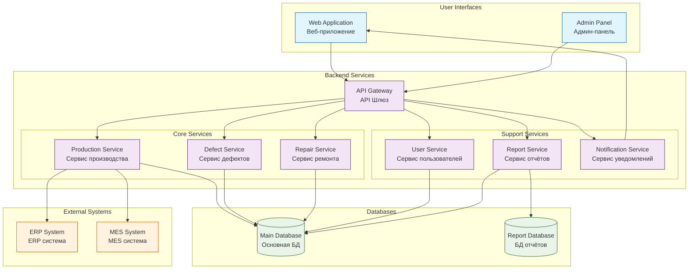

```mermaid
graph TD
    subgraph "User Interfaces"
        WebApp[Web Application<br/>Веб-приложение]
        AdminPanel[Admin Panel<br/>Админ-панель]
    end
    
    subgraph "Backend Services"
        API[API Gateway<br/>API Шлюз]
        
        subgraph "Core Services"
            ProductionService[Production Service<br/>Сервис производства]
            DefectService[Defect Service<br/>Сервис дефектов]
            RepairService[Repair Service<br/>Сервис ремонта]
        end
        
        subgraph "Support Services"
            UserService[User Service<br/>Сервис пользователей]
            ReportService[Report Service<br/>Сервис отчётов]
            NotificationService[Notification Service<br/>Сервис уведомлений]
        end
    end
    
    subgraph "Databases"
        MainDB[(Main Database<br/>Основная БД)]
        ReportDB[(Report Database<br/>БД отчётов)]
    end
    
    subgraph "External Systems"
        ERPSystem[ERP System<br/>ERP система]
        MESSystem[MES System<br/>MES система]
    end
    
    WebApp --> API
    AdminPanel --> API
    
    API --> ProductionService
    API --> DefectService
    API --> RepairService
    API --> UserService
    API --> ReportService
    API --> NotificationService
    
    ProductionService --> MainDB
    DefectService --> MainDB
    RepairService --> MainDB
    UserService --> MainDB
    
    ReportService --> ReportDB
    ReportService --> MainDB
    
    ProductionService --> ERPSystem
    ProductionService --> MESSystem
    
    NotificationService --> WebApp
    
    classDef ui fill:#e1f5fe,stroke:#01579b
    classDef service fill:#f3e5f5,stroke:#4a148c
    classDef db fill:#e8f5e8,stroke:#1b5e20
    classDef external fill:#fff3e0,stroke:#e65100
    
    class WebApp,AdminPanel ui
    class API,ProductionService,DefectService,RepairService,UserService,ReportService,NotificationService service
    class MainDB,ReportDB db
    class ERPSystem,MESSystem external
```