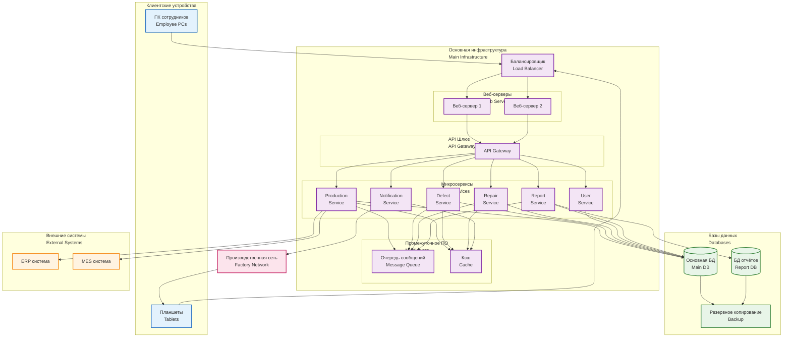

```mermaid
graph TB
    subgraph "Клиентские устройства<br/>Client Devices"
        direction LR
        PC[ПК сотрудников<br/>Employee PCs]
        Tablet[Планшеты<br/>Tablets]
    end

    subgraph "Основная инфраструктура<br/>Main Infrastructure"
        LoadBalancer[Балансировщик<br/>Load Balancer]
        
        subgraph "Веб-серверы<br/>Web Servers"
            WS1[Веб-сервер 1]
            WS2[Веб-сервер 2]
        end
        
        subgraph "API Шлюз<br/>API Gateway"
            APIG[API Gateway]
        end
        
        subgraph "Микросервисы<br/>Microservices"
            direction TB
            PS[Production<br/>Service]
            DS[Defect<br/>Service]
            RS[Repair<br/>Service]
            US[User<br/>Service]
            RepS[Report<br/>Service]
            NS[Notification<br/>Service]
        end
        
        subgraph "Промежуточное ПО<br/>Middleware"
            MQ[Очередь сообщений<br/>Message Queue]
            Cache[Кэш<br/>Cache]
        end
    end

    subgraph "Базы данных<br/>Databases"
        direction LR
        MainDB[(Основная БД<br/>Main DB)]
        ReportDB[(БД отчётов<br/>Report DB)]
        Backup[Резервное копирование<br/>Backup]
    end

    subgraph "Внешние системы<br/>External Systems"
        direction LR
        ERP[ERP система]
        MES[MES система]
    end

    Factory[Производственная сеть<br/>Factory Network]

    PC --> LoadBalancer
    Tablet --> LoadBalancer
    
    LoadBalancer --> WS1
    LoadBalancer --> WS2
    WS1 --> APIG
    WS2 --> APIG
    
    APIG --> PS
    APIG --> DS
    APIG --> RS
    APIG --> US
    APIG --> RepS
    APIG --> NS
    
    PS --> MQ
    DS --> MQ
    RS --> MQ
    RepS --> MQ
    
    PS --> Cache
    DS --> Cache
    RS --> Cache
    NS --> Cache
    
    PS --> MainDB
    DS --> MainDB
    RS --> MainDB
    US --> MainDB
    RepS --> MainDB
    RepS --> ReportDB
    
    MainDB --> Backup
    ReportDB --> Backup
    
    PS --> ERP
    PS --> MES
    
    NS --> Factory
    Factory --> Tablet

    classDef client fill:#E3F2FD,stroke:#1565C0,stroke-width:2px
    classDef infra fill:#F3E5F5,stroke:#7B1FA2,stroke-width:2px
    classDef db fill:#E8F5E8,stroke:#2E7D32,stroke-width:2px
    classDef external fill:#FFF3E0,stroke:#F57C00,stroke-width:2px
    classDef factory fill:#FCE4EC,stroke:#C2185B,stroke-width:2px
    
    class PC,Tablet client
    class LoadBalancer,WS1,WS2,APIG,PS,DS,RS,US,RepS,NS,MQ,Cache infra
    class MainDB,ReportDB,Backup db
    class ERP,MES external
    class Factory factory
```